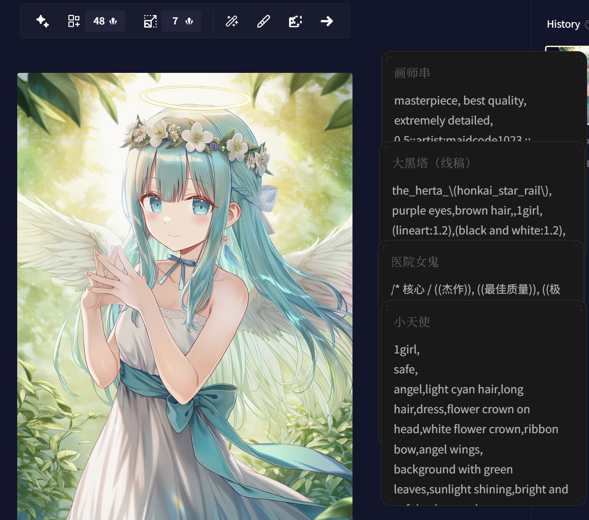

[简体中文](README.md) | **繁體中文** | [English](README_en-US.md)

<!-- markdownlint-disable -->

# 花箋 RegulusApplEx

輕巧、優雅、現代化的本機便箋工具（RegulusApplEx 衍生專案） 
基於 Tauri 2 + React 構建

[回報問題](https://github.com/Achilng/floral-notepaper/issues) · [更新日誌](https://github.com/Achilng/floral-notepaper/releases)  
[快速開始](#快速開始) · [FAQ](https://github.com/Achilng/floral-notepaper/wiki) · [構建指南](#從原始碼構建)

 

 

<!-- markdownlint-restore -->

---

## 為什麼選擇花箋

市面上現有的筆記或便箋軟件，要麼功能繁重、上手門檻高，要麼介面陳舊、久未更新。花箋因此而生，其特點是輕巧、隨呼隨用，同時提供現代化的介面與舒適的編輯體驗。

## 功能特點

- **Markdown 編輯與預覽** — 支援 GitHub Flavored Markdown 語法，可即時切換編輯及預覽模式

  

- **快速便箋** — 透過系統匣或全域快速鍵（預設 `Ctrl+Space`）隨時喚出便箋視窗

  

- **磁貼模式** — 將筆記固定於桌面某處，以便快速查閱及複製

  

- **匯入匯出** — 支援 `.md` 檔案的匯入及匯出

## 應用場景

- 用作隨時可見的剪貼簿，快速暫存及複製文字
- 遊戲、觀看影片時隨手記錄
- 臨時記錄思路或靈感
- 桌面待辦清單

## 快速開始

### 下載安裝

#### 透過 Mirror 醬下載

> [!TIP]
> 如您的網絡不便訪問 GitHub，或下載速度過慢，您可以嘗試透過 Mirror 醬下載花箋 
> 此外，您也可以透過使用 Mirror 醬下載花箋來贊助花箋的開發者，詳見 [Mirror 醬官網](https://mirrorchyan.com/)

| 系統    | 架構                    | 下載連結                                                                                                                                                                                                                                                                                                                                                                                                                                                                     |
| ------- | ----------------------- | ---------------------------------------------------------------------------------------------------------------------------------------------------------------------------------------------------------------------------------------------------------------------------------------------------------------------------------------------------------------------------------------------------------------------------------------------------------------------------- |
| Windows | x64                     |            |
| Windows | AArch64                 |  |
| macOS   | AArch64 (Apple Silicon) |                                                                                                                                                                                                                                                                                        |
| macOS   | x64 (Intel)             |                                                                                                                                                                                                                                                                                                      |

#### 透過 GitHub 下載

請前往 [Release 頁](https://github.com/Achilng/floral-notepaper/releases/latest) 下載花箋

##### 下載參考

| 系統    | 架構                    | 類型             | 檔案名稱                                    |
| ------- | ----------------------- | ---------------- | ------------------------------------------- |
| Windows | x64                     | 安裝程式（推薦） | floral-notepaper\_版本號\_x64-setup.exe     |
| Windows | x64                     | 可攜版           | floral-notepaper\_版本號.exe                |
| Windows | x64                     | 安裝包           | floral-notepaper\_版本號\_x64.msix          |
| Windows | AArch64                 | 安裝程式（推薦） | floral-notepaper\_版本號\_aarch64-setup.exe |
| Windows | AArch64                 | 安裝包           | floral-notepaper\_版本號\_aarch64.msix      |
| macOS   | AArch64 (Apple Silicon) | DMG              | floral-notepaper\_版本號\_aarch64.dmg       |
| macOS   | x64 (Intel)             | DMG              | floral-notepaper\_版本號\_x64.dmg           |

#### 透過 Microsoft Store 下載

前往 [Microsoft Store](https://apps.microsoft.com/detail/9NRCC0ZSG81R) 下載花箋

> 注意：MSIX 安裝（無論來自 Microsoft Store 或側載的 .msix 檔案）暫不支援應用程式內更新，請透過 Microsoft Store 或 GitHub Releases 取得最新版本。

<!-- markdownlint-disable -->

<!-- markdownlint-restore -->

#### macOS 版安裝指引

如遇安裝問題，請參考：

- Wiki 中的 [macOS 安裝指引](https://github.com/Achilng/floral-notepaper/wiki/macOS-%E5%AE%89%E8%A3%85%E6%8C%87%E5%BC%95-%7C-macOS-Installation-Guidance)
- 或影片（Bilibili）：[Mac雲課堂 - 在 Mac 上裝軟件，要學會和蘋果鬥智鬥勇](https://www.bilibili.com/video/BV1tg411t7hN)

### 從原始碼構建

請參考 [CONTRIBUTING.md](CONTRIBUTING.md)

## Star History

## 🌟 貢獻者

## Sponsors

<!-- markdownlint-disable -->

|  | Free code signing provided by [SignPath.io](https://signpath.io), certificate by [SignPath Foundation](https://signpath.org/) |
| -------------------------------------------------------------------------------- | ----------------------------------------------------------------------------------------------------------------------------- |

<!-- markdownlint-restore -->

## 授權條款

[MIT](LICENSE)
